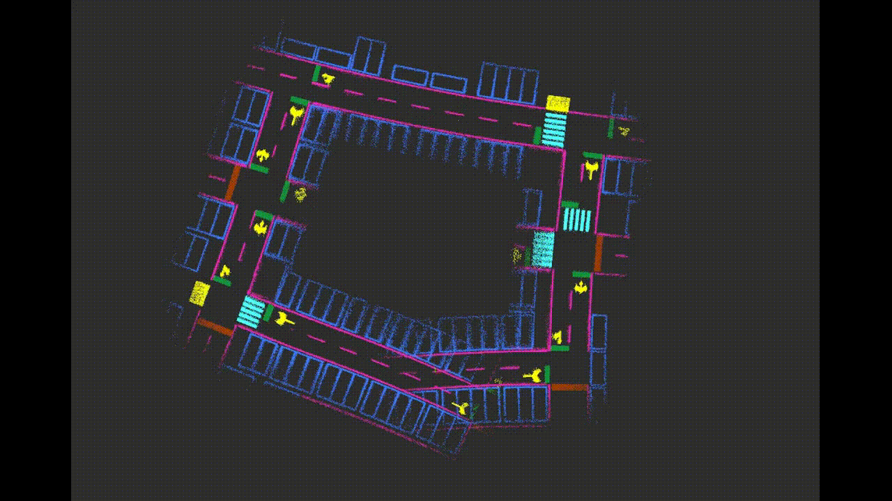

# AVP_MAPPING

A mapping system for autonomous valet parking(AVP).

Developing [--------> 40 % ---------------]

- [x] Simulation
  - [x] static world
  - [ ] dynamic agents 
- [x] Data pretreatment
  - [x] vidar point cloud
  - [x] bev image
  - [ ] NN based Semantic segmentation
  - [ ] occupied grid for submap
- [x] Front End
  - [x] Odom with scale rate
  - [ ] IMU & Encoder Fusion
- [x] Back End
  - [x] 3D PGO using ceres
  - [ ] 3D PGO using g2o
- [x] Loop Closing
  - [x] Object based loop closing
- [x] Mapping & Visualization 
  - [x] Cloud map
  - [ ] Grid map
  - [ ] Vector map


## Quick Start

**Clone and build**
 
```shell
mkdir -p ~/catkin_ws/src
cd ~/catkin_ws/src
git clone git@github.com:adin-pro/avp_mapping.git
cd ..
catkin_make
source devel/setup.zsh
```

**Prepare model & materials for simulation**

unzip parklot.tar.gz and copy extraced files to .gazebo/models/

```shell
tar -zxvf parklot.tar.gz;
cp -r parklot/ .gazebo/models/
```

###  Online Mode

**Launch Simulation world and rviz**

replace `word_dir`  in `avp_mapping/config/global_config.yaml` with your own path

```shell
roslaunch avp_mapping online_simulation.launch
```

**Control your robot**

```shell
roslaunch avp_mapping robot_control.launch
rosrun avp_mapping avp_data_pretreat_node
```

**Launch Mapping Nodes**

```shell
roslaunch avp_mapping online_mapping.launch
```


###  Offline Mode [Recommended]

Use rosbag to record data, and then use offline mode for more efficient program development

```shell
roslaunch avp_mapping offline_mode.launch
```


## Result

**Loop Closing**




**Trajs after Pose Graph Optimization**


**Mapping**

Before Optimization


After Optimization


----

## Acknowlegement:

1. Code FrameWork https://github.com/Little-Potato-1990/localization_in_auto_driving
2. Gazebo simulation environment https://github.com/TurtleZhong/AVP-SLAM-SIM
3. Robot Control Module https://github.com/huchunxu/ros_exploring
4. Implementation Reference https://github.com/liuguitao/AVP-SLAM-PLUS
